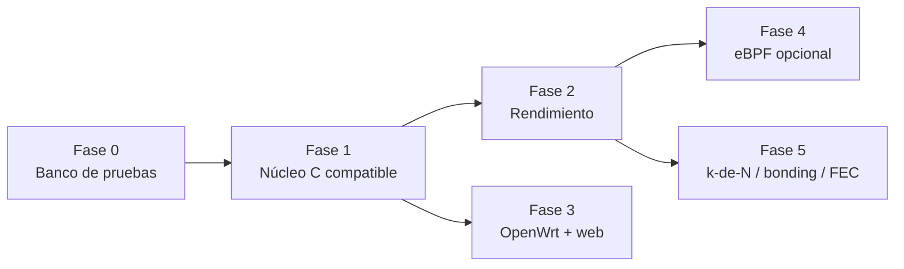

# cengarde: vista general, diagnóstico y roadmap

> Propuesta de octubre de 2026. Se basa en la lectura del código Go heredado de
> [porech/engarde](https://github.com/porech/engarde) y en mediciones
> reproducibles con el laboratorio de [`bench/`](bench/README.md). El detalle de
> cada investigación (referencias al código, datos crudos, fuentes) está en
> [`docs/historias/`](docs/historias/README.md).
>
> Las secciones 1 y 2 describen el engarde Go original. Su código salió del
> árbol el 2026-10-04 y sigue en el historial (commit `3492df9`), desde donde
> el laboratorio lo compila con `ENGINE=go` para compararse.

## Resumen

1. **El techo actual es sobre todo de diseño, no solo de lenguaje.** En bajada
   (VPS → Pi), el cliente Go gasta 23 µs de CPU por paquete con 1 enlace, 60 µs
   con 2 y 96 µs con 3: crece más rápido que el número de enlaces. Un prototipo
   en C de ~200 líneas, con el mismo protocolo, baja a 24 µs con 3 enlaces
   (16 µs deduplicando). Trasladado a una Raspberry Pi 4 (3–4× más lenta por
   núcleo que la máquina de pruebas), el cliente Go se queda del orden de
   30–50 Mbit/s con 3–4 enlaces: coherente con lo que observas, aunque hay que
   confirmarlo en la Pi ([sección 7](#7-qué-medir-en-la-raspberry-pi)).
2. **Un enlace lento arrastra a los rápidos.** Con el timeout por defecto, el
   socket del enlace lento se destruye y se recrea constantemente (9 veces en
   8 s), con picos de latencia de 10–30 ms y hasta un ~1 % de pérdida. Con
   `writeTimeout: -1`, todo el túnel cae al ritmo del enlace lento: 77 % de
   pérdida y más de 200 ms de latencia, aunque los otros dos enlaces
   no tengan ningún límite.
3. **Hay pérdidas que la redundancia no cubre.** El servidor lee todos los
   caminos con un solo socket y una sola goroutine. Cuando se atasca, se
   pierden las tres copias del mismo paquete a la vez, y para TCP dentro del
   túnel incluso un 0,01–0,3 % de pérdida limita mucho el throughput.
4. **Problemas de seguridad y robustez comprobados.** Cualquier dirección que
   envíe un paquete al puerto del servidor recibe todo el tráfico del túnel
   durante 30 s (sirve para reflexión DDoS si se falsifica la IP de origen). El
   cliente muere con un `panic` si el puerto de la web está ocupado. El
   detector de carreras de Go encuentra 15–16 data races en el cliente y 6 en
   el servidor en 10 s de uso normal.
5. **La redundancia pura nunca supera al enlace más rápido.** Si cada enlace da
   ~30 Mbit/s, ninguna reescritura pasará de ~30 Mbit/s en modo redundante.
   Para sumar enlaces hace falta agregación (bonding) o FEC, que están en la
   Fase 5.
6. **Orden recomendado:** banco de pruebas → núcleo en C (protocolo propio;
   cliente y servidor siempre cengarde) → rendimiento → producto (OpenWrt +
   web) → eBPF como acelerador opcional → modos más allá de la redundancia
   pura.

> **Actualización 2026-10-03:**
> - El usuario confirmó en campo el límite de CPU de la Pi (historia 004) y
>   decidió que cliente y servidor sean cengarde desde el primer día, así que
>   se abandona la compatibilidad en el cable con engarde Go.
> - El motor C v1 ya funciona (`engine/`, historia 005). En el laboratorio
>   gasta 4–7× menos CPU por paquete que el cliente Go, no pierde paquetes
>   donde el Go perdía hasta un 38 % y aguanta el enlace lento sin despeinarse.
> - Fase 2, salud de los enlaces y baja latencia (historia 006): un enlace con
>   500 ms de cola se silencia en 3–3,6 s sin pérdidas y vuelve sin oscilar;
>   `busy_poll_us` baja la latencia mediana por debajo de la del Go a cambio
>   de CPU.
> - OpenWrt limpio (historias 007 y 008), no SmoothWAN, que está abandonado y
>   trae kernel 5.x:
>   - imágenes y paquetes para 25.12 y 24.10;
>   - todo se configura desde LuCI con un solo secreto compartido con el
>     VPS;
>   - probado de punta a punta en QEMU.
>
>   Siguiente: probarlo en la Pi 4 y en Vultr.

> **Actualización 2026-10-04:**
> - Recarga sin cortar, `cengarde ctl` e IP pass pedido desde el router
>   (historia 009).
> - Plan en cinco PRs para IPv6, respuesta desde la dirección de llegada,
>   varios routers por VPS y nombres con DNS dinámico (historia 010). El
>   PR 1 (paquetes 0.4.1, sin cambio de protocolo) está hecho: un reinicio
>   del servidor ya no deja la bajada atascada, y la LAN ya no lee por el
>   túnel los metadatos del VPS, donde está el secreto.
> - El PR 2 (paquetes 0.4.2, sin cambio de protocolo) también: el servidor
>   contesta desde la dirección de llegada (varias IP o IPv6 en el VPS), el
>   router acepta una lista de direcciones del VPS con failover por enlace y
>   elige bien su IPv6 de origen, y la IPv6 de la LAN ya no sale por fuera
>   del túnel.

## 1. Cómo funcionaba engarde (Go)

```
 apps ─ wg0 ─► 127.0.0.1:59401 ┌──────────── engarde-client (Go) ─────────────┐
                               │ 1 goroutine: lee de WG y escribe EN SERIE,   │
                               │   con escritura bloqueante, en cada enlace   │
                               │ N goroutines (una por enlace): leen y        │
                               │   escriben todas en el mismo socket de WG    │
                               └──── wwan0 ──── eth1 ──── wlan0 ──────────────┘
                                       │         │         │  SO_BINDTODEVICE
                              ═════════╪═════════╪═════════╪═════ Internet
                                       ▼         ▼         ▼
                               ┌──────────── engarde-server (Go) ─────────────┐
                               │ 1 socket + 1 goroutine para todos los caminos│
                               │ "cliente" = cualquier IP:puerto que escriba  │
                               │ reenvía las N copias a WireGuard             │
                               └──────────► 127.0.0.1:59301 ─ wg0 ────────────┘
```

- **Protocolo:** no hay cabecera propia; viajan los datagramas de WireGuard tal
  cual. Los duplicados los descarta la ventana anti-replay de WireGuard, pero
  **después de descifrarlos**: cada paquete se descifra N veces.
- **Cliente:** cada segundo recorre `net.Interfaces()`. Abre un socket por
  interfaz con IPv4 (IPv6 no está soportado, hay un `TODO` en
  `isAddressAllowed`), descarta 127/8 y 169.254/16 y, por defecto, usa todas
  las interfaces que no estén excluidas.
- **Servidor:** no distingue clientes. Se lanza una instancia por cliente y un
  camino caduca a los 30 s sin tráfico (`clientTimeout`).
- **Web:** Angular 20 + Material embebido con `go:embed`, Basic Auth, consulta
  cada segundo y API `/api/v1/*` (get-list, include, exclude, swap-exclusion,
  reset-exclusions).
- **Build:** Makefile con `go build` cruzado y publicación en GitHub Pages.
  Cada ejecutable ocupa ~6 MB en arm64 y ~7 MB en mipsle, ya sin símbolos y
  sin contar la UI embebida. El empaquetado de OpenWrt vive en el repo aparte
  `porech/openwrt-engarde`.

**Lo que conviene conservar:** la simplicidad (funciona con cualquier
WireGuard sin tocarlo), que el failover no tenga ningún retardo porque todo
viaja siempre por todos los enlaces, y la configuración mínima en el lado
servidor.

## 2. Diagnóstico medido

Resumen; las causas con referencias archivo:línea y los datos crudos están en la
[historia 001](docs/historias/001-diagnostico-engarde-go.md).

### 2.1 Laboratorio

Con `bench/lab.sh` se montan dos network namespaces ("cli" = Pi, "srv" = VPS)
unidos por 3 pares veth. `udpgen` hace de WireGuard en ambos extremos con
paquetes de 1400 B numerados y con marca de tiempo. La CPU de cada proceso se
lee de `/proc/<pid>/stat`. Máquina: VM con Xeon a 2,1 GHz y 4 vCPU. **Los
valores absolutos no son los de una Pi; las proporciones entre variantes sí
sirven.** Todo se reproduce con `sudo bench/lab.sh suite`; al repetirla, las
cifras varían en torno a ±10 % (por ejemplo, 91–103 µs para el cliente Go con
3 enlaces y 21,6–23,6 µs para el prototipo C).

### 2.2 Coste del cliente Go según el número de enlaces (10.000 pps ≈ 112 Mbit/s)

| Enlaces | Bajada: µs CPU/paquete | Subida: µs CPU/paquete |
| ---: | ---: | ---: |
| 1 | 23,6 | 26,8 |
| 2 | 60,4 | 29,4 |
| 3 | 96,4 | 32,2 |

En bajada, las N goroutines compiten por el mismo socket de WireGuard.
`strace -c` muestra ~1,5 `futex` y ~2 `epoll_pwait` por cada
`recvfrom`/`sendto` útil: en cada envío y recepción el runtime aparca y
despierta goroutines, que además compiten por el lock de escritura del socket
compartido. Con 3 enlaces el proceso no pasa de ~130 % de CPU aunque haya 4
núcleos.

### 2.3 Go frente a un prototipo en C (cliente, 3 enlaces, mismo servidor Go)

`bench/protoclient.c` implementa el mismo protocolo: interopera sin cambios con
engarde-server. Usa epoll, lotes con `recvmmsg`/`sendmmsg` y envíos no
bloqueantes (si un enlace está lleno se descarta solo para ese enlace, sin
esperar), y opcionalmente deduplica antes de entregar a WireGuard.

| Dirección | pps | Go | C | C + dedup |
| --- | ---: | ---: | ---: | ---: |
| bajada | 10.000 | 93,0 µs (93 % CPU) | 23,6 µs (24 %) | 15,6 µs (16 %) |
| bajada | 20.000 | 59,4 µs (119 %) | 19,3 µs (39 %) | 13,0 µs (26 %) |
| bajada | 40.000 | 32,7 µs (131 %) | 15,9 µs (64 %) | 10,8 µs (43 %) |
| subida | 10.000 | 33,6 µs | 15,6 µs | 15,4 µs |
| subida | 30.000 | 17,2 µs | 9,5 µs | 9,7 µs |

La deduplicación además ahorra a WireGuard descifrar N−1 copias de cada
paquete, cosa que este laboratorio no mide porque no cifra. En subida, a
30.000 pps todas las variantes pierden entre un 1 y un 4 % porque el cuello de
botella es el servidor Go (sección 2.4).

### 2.4 El servidor usa un solo núcleo y sus pérdidas van juntas

- Con 3 enlaces satura un núcleo a ~35.000–37.000 pps únicos (~110.000 copias
  por segundo). Un solo socket y una sola goroutine leen todos los caminos de
  todos los clientes.
- En subida a 20.000 pps, sin llegar a saturar, ya pierde un 0,3–0,6 %. Los
  contadores del kernel lo localizan: hubo 880 `UdpRcvbufErrors` en el socket
  del servidor, y 834 de esas 880 copias pertenecían a paquetes que perdieron
  sus 3 copias. La redundancia no protege de lo que se pierde después de juntar
  los caminos o antes de separarlos.
- Para TCP dentro del túnel esto pesa mucho. Con la aproximación de Mathis
  (Reno, RTT 50 ms, MSS 1380 B), un 0,3 % de pérdida limita cada flujo a
  ~5 Mbit/s y un 0,01 % a ~27 Mbit/s. CUBIC y BBR toleran algo más, pero el
  orden de magnitud no cambia.

### 2.5 Un enlace lento bloquea a los demás (head-of-line blocking)

Subida a 2.000 pps (22 Mbit/s) con l1 y l2 sin límite y l3 limitado a 5 Mbit/s
con `tbf`, es decir, con la cola en la propia máquina, como un módem USB o un
WiFi lento:

| Configuración | Pérdida | Latencia | Qué pasa |
| --- | ---: | --- | --- |
| sin límite | 0,02 % | p50 0,17 ms | — |
| l3 a 5 Mbit/s, `writeTimeout: 10` (defecto) | 0–1 % | p50 0,15 ms, p99.9 10–30 ms | el socket de l3 se destruye y se recrea 9 veces en 8 s; l3 solo llevó 1.269 de 16.000 paquetes porque pasó casi todo el tiempo fuera del pool |
| l3 a 5 Mbit/s, `writeTimeout: -1` | **77 %** | **p50 > 200 ms** | l1 y l2, sin límite, quedan frenados al ritmo de l3 |

La causa está en `receiveFromWireguard`, que escribe en serie en cada enlace
con escritura bloqueante. Cuando el buffer de envío del enlace lento se llena,
el kernel no despierta al escritor hasta que se vacía la mitad: decenas de
paquetes, unos 100 ms a 5 Mbit/s, muy por encima del timeout de 10 ms. Les
pasa a todos los enlaces de menos de ~50 Mbit/s cuya cola se llene en la propia
máquina. Además, una cola local tan grande (bufferbloat) retrasa el failover
hacia ese enlace en lo que tarde en vaciarse.

### 2.6 Bugs y riesgos verificados

| # | Problema | Evidencia | Impacto |
| --- | --- | --- | --- |
| 1 | Cualquier IP:puerto que envíe un paquete al servidor pasa a ser "cliente" y recibe toda la bajada durante `clientTimeout` | `bench/lab.sh demo_stranger`: 1 paquete enviado, 9.116 recibidos | reflexión/amplificación DDoS con IP falsificada; fuga de metadatos de tráfico |
| 2 | `panic: http: multiple registrations for /` si el puerto de la web está ocupado: `webserver()` vuelve a registrar las rutas en cada reintento | `demo_webpanic`: sale con código 2 al ~1 s | un fallo de la UI tumba el túnel |
| 3 | Data races en `sendingChannels`, `exclusionSwaps`, `clients`, `LastRec`, `IsClosing`, `Last` y el puntero `wgAddr` | `demo_races`: 15–16 en el cliente y 6 en el servidor | un acceso concurrente a un mapa puede provocar `fatal error: concurrent map read and map write` |
| 4 | Un error de escritura destruye el socket del enlace, que vuelve en ≤1 s | sección 2.5 | enlaces que entran y salen sin parar |
| 5 | Buffer fijo de 1500 B | código | con MTU de WireGuard > 1468 los paquetes se truncan sin aviso |
| 6 | Interfaces por sondeo cada segundo | código | un enlace nuevo o con IP nueva tarda hasta 1 s; ~7 consultas netlink por segundo |
| 7 | Sin IPv6 | `isAddressAllowed` | no sirven los enlaces móviles solo IPv6 (464XLAT) |
| 8 | El servidor no distingue clientes: cada uno recibe el tráfico de los demás | `receiveFromWireguard` envía a todos | hace falta una instancia y un puerto por cliente |
| 9 | Por defecto se usan todas las interfaces no excluidas | código | docker0, VPNs o el propio wg0 (bucle) entran si no se excluyen |
| 10 | Web: GET con efectos (`reset-exclusions`), POST sin protección CSRF, Basic Auth en claro, el ejemplo escucha en `0.0.0.0:9001` con `engarde/engarde` | código | una web maliciosa abierta en el navegador del administrador podría cambiar exclusiones (CSRF); credenciales en claro |
| 11 | Un log por paquete en errores del camino caliente, y escritura a `wgAddr` nulo hasta que WG habla | código | inunda los logs y gasta CPU en tormentas de errores |

### 2.7 Qué significa en una Raspberry Pi

Una Pi 4 (Cortex-A72 a 1,5–1,8 GHz) es aproximadamente 3–4× más lenta por
núcleo que la máquina de pruebas, una Pi 3 ~8× y una Pi 5 se queda cerca. Con
3 enlaces, los ~95 µs por paquete del cliente Go pasan a ser ~300–400 µs en
una Pi 4. Como la contención limita el runtime a ~1,3 núcleos útiles, salen
~3.000–4.500 pps, unos 35–50 Mbit/s, y eso sin contar que WireGuard descifra
las N copias ni el coste de los drivers USB. Con 4 enlaces baja más.

La zona de ~30 Mbit/s que ves encaja con un límite de CPU del cliente Go, pero
el otro sospechoso, la capacidad del enlace más rápido, da el mismo síntoma.
La [sección 7](#7-qué-medir-en-la-raspberry-pi) explica cómo distinguirlos.

## 3. Decisiones de diseño previas

1. **Redundancia no es más ancho de banda.** Con duplicación total, el
   throughput útil es como mucho el del enlace más rápido, y cada enlace
   transporta el tráfico completo (N veces el consumo de datos).
2. **La ganancia viene del diseño:** no bloquear nunca el plano de datos,
   trabajar por lotes, no pasar paquetes entre hilos, deduplicar antes de
   WireGuard y no meter todos los caminos del servidor en una sola cola. C
   añade lo suyo: un binario de ~100 KB frente a ~6–7 MB por ejecutable en Go
   (decisivo en routers con 16 MB de flash), latencia predecible sin GC, acceso
   directo a netlink y a las opciones de socket, y estructuras compartidas con
   los programas eBPF.
3. **eBPF no vectoriza.** No tiene SIMD ni admite bucles pesados. Lo que
   aporta es no copiar paquetes a espacio de usuario ni hacer syscalls:
   duplicar en TC con `bpf_clone_redirect` y deduplicar en XDP. La
   vectorización (NEON en la Pi, AVX2 en el VPS) tiene sentido en espacio de
   usuario para FEC (XOR o Reed-Solomon) y hashing. En la Pi, y con módems USB,
   normalmente solo hay XDP genérico, así que la ganancia de eBPF será menor
   que en un VPS.
4. **Deduplicar sí, pero solo duplicados exactos.** Si se descarta por
   "contador ya visto", un atacante en uno solo de los enlaces (una WiFi
   pública, por ejemplo) ve contadores consecutivos, inyecta paquetes falsos
   con contadores futuros y consigue que se descarten los buenos que llegan por
   los demás enlaces: tumba el túnel entero. La clave debe ser (índice
   receptor, contador, tag Poly1305). Un paquete falso con el mismo contador
   tiene otro tag, así que se reenvía, WireGuard lo rechaza y el bueno pasa.
   *Resuelto de otra forma en el motor v1:* la cabecera propia lleva un MAC
   sobre cabecera y payload, y solo una copia verificada marca su secuencia
   (historia 005).
5. **C en un demonio expuesto a Internet** pierde la seguridad de memoria de
   Go. Hay que compensarlo con una superficie de parseo mínima, fuzzing
   (libFuzzer o AFL++) de los parsers de paquetes, configuración y HTTP,
   ASan/UBSan en CI, flags de hardening y privilegios mínimos. Si la seguridad
   llegara a pesar más que C, existe el port a Rust `rengarde`.
6. ~~Compatibilidad en el cable con engarde Go en las primeras fases.~~
   **Cambiado el 2026-10-03:** cliente y servidor son siempre cengarde (es una
   reconstrucción), así que hay protocolo propio con cabecera autenticada
   desde el primer día (historia 005).
7. **Linux primero.** El objetivo es Pi, OpenWrt y VPS. Un cliente para
   Windows o macOS necesitaría un port del motor, porque ya no habla el
   protocolo de engarde Go.

## 4. Arquitectura propuesta

Un único binario `cengarde` con los roles `client` y `server`, que era el
segundo deseo del autor original.

### 4.1 Plano de datos del cliente

```
          ┌─────────────────────── hilo de datos (epoll) ────────────────────────┐
 wg0 ────►│ recvmmsg (lote ≤64) ─► por enlace: sendmmsg(MSG_DONTWAIT)           │──► wwan0 / eth1 / wlan0
          │                       EAGAIN ⇒ se descarta solo en ese enlace       │
 wg0 ◄────│ sendmmsg ◄─ dedup exacta ◄─ recvmmsg de cada enlace                 │◄── wwan0 / eth1 / wlan0
          └──────────────────────────────────────────────────────────────────────┘
          hilo de control: netlink (enlaces y direcciones), API por socket Unix, estadísticas
```

- Sin locks en el camino caliente: la tabla de enlaces es inmutable y se
  publica con un puntero atómico, o el hilo de control manda órdenes por un
  `eventfd`.
- Buffers preasignados, ningún `malloc` por paquete, tamaño máximo de 64 KiB y
  detección de `MSG_TRUNC`. `SO_RCVBUF` grande (`SO_RCVBUFFORCE`) y aviso si
  `net.core.rmem_max` es bajo.
- Enlaces con `SO_BINDTODEVICE` más bind a la IP del enlace, IPv4 e IPv6.
  Selección por lista explícita o patrones (`wwan*`), y exclusión automática
  de `lo`, `wg*`, bridges y `docker*`.
- Deduplicación por la secuencia autenticada de la cabecera propia (ventana
  anti-replay de 8192 bits). Aparte, un anillo de llegadas guarda la máscara de
  enlaces por los que llegó cada paquete y la hora de la primera copia
  (historia 005).
- De esa tabla salen estadísticas por enlace sin coste extra: cuántas veces
  llegó primero ("wins"), su retardo frente al más rápido y una pérdida
  aproximada (huecos reciclados sin el bit de ese enlace).

### 4.2 Servidor

- **Sesiones** por el id de sesión de la cabecera propia (hecho en v1). Ya no
  hace falta observar los índices de WireGuard. Cada sesión tiene su propio
  socket hacia WireGuard, como un NAT, de modo que el WireGuard del servidor ve
  a cada cliente como un endpoint distinto. Así caben **varios clientes en un
  mismo puerto**, incluso cuando es el servidor quien inicia el handshake.
- **Admisión de caminos** (hecho en v1): una sesión o un camino nuevo (o un
  cambio de dirección) solo se acepta con el MAC verificado, y nunca se envía
  a una dirección sin confirmar. Eso cierra la reflexión del bug 1.
- **Varios hilos** con `SO_REUSEPORT`: cada camino va a un hilo por hash de la
  4-tupla, de modo que se usan todos los núcleos y las copias de un mismo
  paquete ya no comparten cola.
- Opcional, si las medidas lo justifican: UDP GSO/GRO (`UDP_SEGMENT`,
  `UDP_GRO`) para el reparto en el VPS.

### 4.3 Protocolo

- **v1, desde el día uno** (implementado; detalle en la historia 005):
  - cabecera de 24 B con versión y tipo, enlace, sesión, secuencia, marca de
    tiempo y MAC SipHash-2-4 sobre cabecera y payload, con una clave por
    sentido;
  - sondas por enlace (RTT y vista cruzada de cada sentido);
  - la base para FEC, agregación y ARQ.

  Cuesta MTU: el de WireGuard tiene que ser ≤ 1416 sobre IPv4 y ≤ 1396 sobre
  IPv6 con una ruta de 1500.
- ~~v0 "compat"~~: descartado (cliente y servidor son siempre cengarde).

### 4.4 Configuración, control y observabilidad

- Formato propio tipo INI (como `wg-quick`), sin dependencias; sin
  conversor desde `engarde.yml`, porque no hay compatibilidad. En OpenWrt se
  usa UCI
  (`/etc/config/cengarde`) y el init script genera los parámetros.
- Recarga con `SIGHUP` sin cortar el túnel (hecho, historia 009): se aplica
  en el lugar, o reinicia el proceso en el lugar para lo que el bucle arma
  una sola vez.
- Socket Unix de control (hecho, historia 009): `cengarde ctl status`,
  `links`, `link wwan1 off|on|auto`, `reset` y `reload`. LuCI lo usa por
  rpcd con un permiso acotado, sin plugin de ubus. Métricas Prometheus
  opcionales.
- Logs con límite de frecuencia: nunca un log por paquete.

## 5. Roadmap por fases



Cada fase tiene un criterio de salida medible con `bench/`. Las duraciones son
orientativas, para una persona a tiempo parcial.

### Fase 0: banco de pruebas y línea base (1–2 semanas)

- [x] Laboratorio con netns, veth y tbf, más el generador UDP (`bench/`).
- [x] Línea base del engarde Go y prototipo C del cliente.
- [ ] Medir en la Pi real ([sección 7](#7-qué-medir-en-la-raspberry-pi)) y
  decidir si el límite es la CPU o los enlaces.
- [ ] WireGuard real en el laboratorio (kernel o wireguard-go) con iperf3 TCP
  dentro del túnel, y escenarios con retardo, jitter y pérdida (`netem`) en
  una máquina que lo tenga.
- [ ] Laboratorio en CI: los runners de GitHub Actions permiten netns con sudo,
  así que se pueden detectar regresiones de rendimiento. En parte:
  `bench/lab.sh ci` (smoke, health, control y restart) detecta fallos, no
  pérdidas de rendimiento.

**Salida:** tabla de referencia reproducible y diagnóstico de la Pi.

### Fase 1: núcleo en C con protocolo propio (3–5 semanas)

**Estado (2026-10-03):** hecho lo esencial en `engine/` (historia 005):
- cliente y servidor, epoll y lotes, netlink, IPv4/IPv6;
- sesiones y admisión por MAC, sondas, estado JSON;
- tests (también bajo qemu en aarch64, armhf y MIPS big-endian) y CI.

Falta lo marcado como pendiente en la historia 005: fuzzing, privilegios
mínimos, binarios estáticos y prueba en la Pi real. El socket de control y
la recarga en caliente llegaron con la historia 009.


- **1a: cliente**, que es lo que ataca el problema de la Pi si resulta ser de
  CPU.
  - `cengarde client` con epoll, sin bloqueos y sin locks en el camino
    caliente.
  - Netlink en vez de sondeo; IPv4 e IPv6; lista o patrones de interfaces;
    `dstOverrides`; etiquetas.
- **1b: servidor.**
  - `cengarde server` con admisión de caminos y buffers grandes.
- **Común a los dos:**
  - Socket de control (`cengarde ctl`, hecho en la historia 009); logs con
    límite de frecuencia.
  - Tests unitarios, fuzzing de parsers, ASan, UBSan y TSan en CI, y
    hardening (`-D_FORTIFY_SOURCE=3`, `-fstack-protector-strong`, PIE,
    RELRO).
  - Binarios estáticos con musl para aarch64, armv7, x86_64 y mipsel.

**Salida:**
- cliente y servidor cengarde de punta a punta (`bench/lab.sh smoke`) — hecho;
- `demo_stranger` no recibe nada y `demo_webpanic` no tumba el túnel;
- 0 errores de sanitizers en la suite;
- con 3 enlaces, en bajada gasta ≤ 1/3 de la CPU por paquete del cliente Go;
- con un enlace lento los demás no se enteran: 0 % de pérdida, p99 sin cambios
  y ningún socket recreado.

### Fase 2: rendimiento (2–4 semanas)

**Estado (2026-10-03):**
- Hecho: salud de los enlaces, sondeo adaptativo, protocolo v2, `busy_poll_us`,
  `cpu` y `rt_priority`, y el estado escrito desde un hilo aparte
  (historia 006).
- Aplazado hasta medir en el VPS y en la Pi: servidor multihilo, GSO/GRO y
  ajuste del lote.
- Hecho (PR 3b, 2026-10-04): un hilo por enlace en el router para recibir
  (`link_threads = on`), a mano hasta medirlo en la Pi; por omisión, el
  bucle de siempre (historia 011).

- Servidor multihilo con `SO_REUSEPORT`; GSO/GRO donde se demuestre útil.
- Colas cortas por enlace: `SO_SNDBUF` pequeño, descartar en EAGAIN y
  recomendar o configurar fq_codel/cake en los uplinks (`sqm-scripts` en
  OpenWrt). Sin bufferbloat, el failover hacia un enlace lento también es
  inmediato.
- Perfilado en la Pi (`perf`) y ajuste del tamaño de lote.
- **Salud de los enlaces**, inspirada en libRIST
  ([historia 003](docs/historias/003-librist-gestion-de-enlaces.md)) —
  hecho, con estos cambios sobre el plan
  ([historia 006](docs/historias/006-salud-de-enlaces.md)):
  - un enlace mudo sale de la rotación en 1–1,5 s, no en ~300 ms, porque un
    enlace que se llena también enmudece un rato. Vuelve en cuanto contesta;
  - un enlace que llega tarde se silencia con histéresis. Lo mide el otro
    extremo con las sondas, así que no hace falta goteo, y vuelve de golpe
    con espera exponencial: en redundancia pura la rampa reordenaría;
  - siempre llevan todo al menos 2 enlaces y nunca se destruye un socket por
    un error transitorio.

**Salida:**
- `UdpRcvbufErrors` = 0 por debajo del 80 % de CPU;
- el servidor escala con los núcleos;
- en una Pi 4 con 4 enlaces, el límite pasa a ser el de los enlaces (objetivo:
  ≥100 Mbit/s si los enlaces dan para ello);
- un enlace con 500 ms de cola local se silencia sin afectar a los demás y
  vuelve sin oscilar cuando se recupera — hecho (`bench/lab.sh health`, que
  corre en el CI).

### Fase 3: producto (OpenWrt, empaquetado y web; 3–6 semanas, en paralelo con la 2)

**Estado (2026-10-04):** OpenWrt hecho en lo esencial, sin probar aún en
hardware real (historias [007](docs/historias/007-openwrt-y-vps.md) y
[008](docs/historias/008-luci-uci-y-emparejamiento.md)).
- Hecho:
  - los paquetes para OpenWrt 25.12 (apk) y 24.10 (ipk), para la Pi 4 y
    x86_64, en el CI:
    - `cengarde`, con UCI y `cengarde-setup`, que crea el túnel de
      WireGuard, las rutas, las métricas, el DNS, la zona y el UPnP;
    - `luci-app-cengarde`, con estado y configuración;
    - `luci-i18n-cengarde-es`;
  - el emparejamiento con un solo secreto de 256 bits (`cengarde keys`);
  - el cloud-config del VPS, que LuCI entrega listo para copiar;
  - imágenes 25.12 para la Pi 4 y x86-64 con todo incluido;
  - la prueba de punta a punta en QEMU con LuCI (Playwright), en el CI;
  - la unidad systemd y la guía en `openwrt/README.md`;
  - IP pass gobernado desde el router (protocolo v3), cambios aplicados sin
    reiniciar el motor y pausa de enlaces desde LuCI (historia
    [009](docs/historias/009-recarga-control-e-ip-pass.md)).
- Falta:
  - la prueba en la Pi 4 y en Vultr;
  - un feed firmado y más targets;
  - el plan de la historia
    [010](docs/historias/010-ipv6-varias-ip-multicliente-nombres.md), del
    que los PR 1 y 2 están hechos:
    - PR 3: varios routers por VPS (protocolo v4) con un panel de reenvío
      de puertos;
    - PR 4: IPv6 dentro del túnel, apagado por defecto;
    - PR 5: nombres con DNS dinámico, también para un servidor casero.

- **OpenWrt.** El destino es OpenWrt limpio (24.10 y 25.12, kernel 6.x), no
  SmoothWAN, que está abandonado y se quedó en kernel 5.x (historia 004).
  - Paquetes `cengarde` y `luci-app-cengarde` (hechos).
    - El esquema UCI es propio, no el de `openwrt-engarde`: el protocolo de
      cengarde no es compatible y no hay nada que migrar.
  - Pestaña de LuCI (hecha; pedido del usuario, referencia SmoothWAN):
    - estado por enlace;
    - elegir los uplinks;
    - crear el túnel de WireGuard solo;
    - **IP pass** sí/no: el VPS reenvía los puertos 1024–65000 al router, y
      UPnP en el router los reparte a la LAN para tener la IP pública del VPS
      en terreno.
  - Init de procd con respawn (hecho) y sysctl para `rmem_max`.
  - Feed propio (ipk para 24.10 y apk para 25.12) construido con el SDK en
    GitHub Actions para los targets habituales: `aarch64_cortex-a53`,
    `aarch64_cortex-a72`, `arm_cortex-a7_neon-vfpv4`, `mipsel_24kc` y
    `x86_64`.
- **Raspberry Pi OS, Debian y VPS.**
  - Binarios estáticos y `.deb`.
  - Unidad systemd endurecida (`AmbientCapabilities=CAP_NET_RAW
    CAP_NET_ADMIN`, `ProtectSystem=strict`…): hecha, en `contrib/systemd/`.
  - Plantilla cloud-init para el VPS con WireGuard, NAT y reenvío de puertos:
    hecha, en `contrib/vps/`.
  - Imagen Docker mínima para el servidor.
- **API JSON versionada** (`/api/v2`), contrato único para la CLI, LuCI y la
  web.
- **Web.**
  - Sustituir Angular 20 + Material (toolchain de Node y bundle pesados) por
    una UI ligera (JS sin build o Preact + htm, < 50 KB comprimida) con datos
    en vivo por SSE.
  - Gráficas por enlace: throughput, wins, retardo relativo y pérdida.
  - En el servidor, sesiones y caminos.
  - Edición de la configuración con opción de guardarla, y logs.
  - En OpenWrt, LuCI nativo: ni servidor web extra ni contraseñas propias.
  - Seguridad por defecto: escuchar en 127.0.0.1 o en la IP del túnel, sin
    contraseña por defecto, tokens en vez de Basic Auth, ningún GET con
    efectos y protección CSRF.
  - La web corre aislada del plano de datos: si falla, no tumba el túnel.
- **Alta estilo Tailscale:** `cengarde server init` genera las claves de
  WireGuard y una URL o un QR que el cliente importa para configurar
  WireGuard y cengarde de una vez. Es el quinto deseo del autor original.
  - Como en SmoothWAN, basta un solo secreto, pero de 256 bits, no una
    contraseña de 8 caracteres. Está hecho en OpenWrt: el router lo genera y
    el VPS lo recibe en su cloud-config (historia 008).

**Salida:**
- en OpenWrt se instala con un comando y se configura entero desde LuCI;
- el binario pesa menos de 200 KB.

### Fase 4: eBPF como acelerador opcional (4–8 semanas)

- **XDP en la entrada** (uplinks del cliente, NIC del VPS):
  - parsea WireGuard;
  - deduplica de forma exacta en un mapa BPF: anillo por sesión con
    `cmpxchg` atómico, kernel ≥ 5.12;
  - lleva estadísticas por enlace en mapas per-CPU;
  - descarta los duplicados antes de que entren en la pila.
- **TC egress:** reparte en el kernel con `bpf_clone_redirect`, reescribiendo
  IP, puertos, checksums y L2, y usa `bpf_redirect_neigh` (kernel ≥ 5.10) para
  la última copia. Cero copias a espacio de usuario.
- **El demonio en C pasa a plano de control:** carga los programas con libbpf,
  rellena los mapas (enlaces, sesiones, caminos, vecinos) y mantiene el plano
  de datos en espacio de usuario como respaldo automático si no hay soporte
  BPF.
- **Pruebas:** `BPF_PROG_TEST_RUN` en CI más el laboratorio veth (veth admite
  XDP nativo).
- **OpenWrt:** compilar con el `include/bpf.mk` del SDK, igual que `qosify`, sin
  depender de BTF/CO-RE (los programas solo parsean paquetes), en un paquete
  aparte, `cengarde-bpf`.
- **Límite:** en XDP/TC no se pueden retener paquetes, así que la reordenación,
  la agregación y la FEC se quedan en espacio de usuario.

**Salida:**
- en el VPS, la CPU por paquete baja de forma medible respecto a la Fase 2,
  sobre todo con varios clientes;
- en la Pi solo se adopta si las medidas lo justifican.

### Fase 5: más allá de la redundancia pura (continua)

Implementar bonding es fácil; que funcione bien sobre enlaces móviles es un I+D
largo de ensayo y error (Peplink, Mushroom Networks, Speedify…). El NEWS de
libRIST documenta muchos de esos fallos y sus arreglos (historia 003), y es la
lista de comprobación de partida.

- **k-de-N:** cada paquete va solo por los k mejores enlaces, lo que ahorra
  datos en enlaces móviles.
- **Redundancia selectiva por tamaño:** duplicar los paquetes pequeños (ACKs,
  VoIP, handshakes) y repartir los grandes. WireGuard no expone el DSCP
  interior, pero el tamaño sí se ve.
- **Agregación (bonding):** reordenar en el receptor usando el contador de
  WireGuard, sin cabecera propia. El throughput se acerca a la suma de los
  enlaces.
- **FEC** XOR o Reed-Solomon con SIMD (NEON/AVX2), sobre el protocolo v1.
- **Sondas por enlace** (RTT, jitter, pérdida, MTU de camino) y elección
  automática de enlaces.
- **Configuración unificada al estilo libRIST:** peso por enlace, donde 0 es
  duplicar y > 0 es una parte del reparto WRR, de modo que redundancia y
  bonding se mezclan con un solo parámetro.
- **ARQ opcional** (NACK y buffer de latencia, como RIST) como redundancia
  barata: 1–2 enlaces más recuperación por el mejor.

**Salida:** cada modo con su escenario en el laboratorio. Por ejemplo, con 2
enlaces iguales el bonding debe dar ≥1,8× uno solo, y con 4 enlaces la FEC
debe sobrevivir a la caída de uno con ≤1,34× de sobrecoste.

## 6. Checklist de mejoras

**Rendimiento**
- [ ] No bloquear nunca el bucle de datos; descartar por enlace en EAGAIN.
- [ ] Lotes con `recvmmsg`/`sendmmsg`; GSO/GRO en el servidor.
- [ ] Deduplicación exacta antes de WireGuard (N−1 descifrados menos por
  paquete).
- [ ] Un hilo por grupo de caminos en el servidor (`SO_REUSEPORT`).
- [ ] Buffers de socket grandes, ninguna asignación por paquete y reloj grueso
  (`CLOCK_MONOTONIC_COARSE`) leído una vez por iteración.
- [ ] Colas cortas por enlace (AQM) para que el failover sea inmediato.
- [ ] Salud de enlaces con histéresis, goteo y rampa; nunca silenciar al último
  (historia 003).

**Robustez**
- [ ] Netlink en vez de sondear cada segundo.
- [ ] No destruir sockets por errores transitorios: EAGAIN o un timeout no
  significan que el enlace esté caído.
- [ ] Buffers de 64 KiB o detección de truncado. El aviso por enlace
  cuando el MTU de camino no basta ya está (0.4.2, historia 010).
- [ ] IPv6: por fuera del túnel ya está (0.4.2); dentro, en el PR 4
  (historia 010).
- [x] Que un reinicio del servidor no deje la bajada atascada (0.4.1,
  historia 010).
- [ ] Rutas por enlace: documentar o automatizar reglas por origen
  (`ip rule from <ip> table N`) cuando un uplink no tiene ruta por defecto, o
  integrarse con mwan3 en OpenWrt.
- [ ] Keepalives propios por enlace para mantener abierto el NAT (CGNAT con
  timeouts cortos) sin depender de `PersistentKeepalive`.
- [ ] La UI en un proceso o hilo aislado: nunca puede tumbar el plano de datos.

**Seguridad**
- [ ] Admisión de caminos en el servidor (cierra la reflexión).
- [ ] Deduplicar solo duplicados exactos.
- [ ] Web en localhost o en la IP del túnel por defecto, sin credenciales por
  defecto, con CSRF y sin GET que cambien estado.
- [ ] Privilegios mínimos: desde Linux 5.7, `SO_BINDTODEVICE` ya no exige
  CAP_NET_RAW si el socket no estaba ligado a un dispositivo. Usuario sin
  privilegios y procd/systemd endurecidos.
- [ ] Fuzzing, sanitizers y hardening del compilador.
- [x] En el VPS, el túnel no llega a los metadatos (donde está el secreto)
  ni al puerto de WireGuard (0.4.1, probado en netns; historia 010).
- [ ] Que el motor del VPS tampoco llegue a los metadatos: `IPAddressDeny`
  ya está en 0.4.1, sin probar aún en un systemd real (PR 2).
- [ ] Que una sonda reenviada tras un reinicio del servidor no decida el IP
  pass: HELLO del protocolo v4, PR 3 (historia 010).

**Uso y operación**
- [ ] Lista explícita o patrones de interfaces, con exclusión automática de
  `wg*`, `lo`, `docker*` y `br-*`.
- [ ] Opción de guardar los cambios hechos en la UI.
- [ ] Estadísticas por enlace que sirvan de algo: % de wins, retardo relativo,
  pérdida y MTU.
- [x] Recarga en caliente (`SIGHUP`), en cengarde (historia 009).
- [ ] Gestión opcional de la interfaz WireGuard (endpoint, MTU, keepalive) por
  netlink.

**Código y build:** ~~arreglar y limpiar el Go heredado~~. El 2026-10-04 se
retiró del árbol, junto con su UI Angular, su build y la publicación en
GitHub Pages.

## 7. Qué medir en la Raspberry Pi

Con engarde, la Pi se quedaba en ~30 Mbit/s con 4 enlaces, por CPU
(historia 004). Para ver dónde está ahora el techo con cengarde:

1. Capacidad de cada enlace por separado, sin túnel:
   `iperf3 -c <vps> -B <ip_del_enlace>` (y `-R` para la bajada).
2. WireGuard sin cengarde por el mejor enlace: iperf3 contra la IP del túnel.
3. cengarde con 1 enlace y luego con 2, 3 y 4 (los enlaces se eligen en
   LuCI). Si el throughput baja o la CPU se dispara al añadir enlaces, es
   cengarde. Si se queda en lo que da el mejor enlace, son los enlaces.
4. Durante cada prueba:

   ```sh
   top -H -p "$(pidof cengarde)"          # CPU: ¿el núcleo de cengarde al 100 %?
   mpstat -P ALL 1                        # %soft (softirq) por núcleo (paquete sysstat)
   grep -A1 '^Udp:' /proc/net/snmp        # RcvbufErrors creciendo = pérdidas en sockets
   ss -uamp | grep -A1 cengarde           # skmem: d<n> = descartes de ese socket
   tc -s qdisc show dev eth1.10           # cola y descartes de cada uplink
   vcgencmd get_throttled; vcgencmd measure_temp   # ¿throttling térmico o de voltaje?
   cengarde-setup status                  # por enlace: estado, RTT, atraso, silenciados
   ```

5. Ajustes si hace falta:
   - `sysctl -w net.core.rmem_default=4194304 net.core.rmem_max=8388608` y
     `option sndbuf` en `/etc/config/cengarde`, para las ráfagas;
   - `busy_poll_us` y `cpu` (pestaña *Avanzado*) si la latencia importa más
     que la CPU (historia 006);
   - fq_codel o cake en los uplinks, para mantener cortas las colas locales;
   - un MTU de WireGuard conservador en redes móviles (1280–1380).

## 8. Riesgos y mitigaciones

| Riesgo | Mitigación |
| --- | --- |
| Bugs de memoria en C | Parsers mínimos, fuzzing continuo, sanitizers, revisión y separación de privilegios |
| Diferencias de comportamiento con engarde Go | Las mismas pruebas de laboratorio (`compare`) contra la línea base Go, compilada desde el historial |
| Soporte desigual de eBPF (XDP genérico en la Pi y en USB; OpenWrt sin BTF) | eBPF opcional con respaldo automático; nada de CO-RE |
| Alcance (web + OpenWrt + eBPF + modos) | Fases con criterios de salida; la Fase 1a ya ataca el problema de la Pi |
| El secreto viaja en el user data del VPS | El túnel no llega a los metadatos (0.4.1, probado en netns); el motor tampoco (`IPAddressDeny`, sin probar aún en un systemd real; PR 2); los secretos de los demás routers nunca van en el user data (historia 010) |
| La IPv6 de la LAN sale por fuera del túnel si un enlace tiene en el router una interfaz DHCPv6 que delega su prefijo (Starlink) | Desde 0.4.2, con todo el tráfico por el túnel, cengarde pone `delegate 0` en esas interfaces (y en los enlaces PPP o de módem) y avisa si la LAN aún tiene un prefijo público (`ipv6_leak`); probado en QEMU con un prefijo delegado (historia 010) |
| Varios routers por VPS exigen cambiar el protocolo (v4) | Un solo cambio de formato, en el PR 3, con paquetes 0.5.0 en los dos extremos; la migración desde 0.4 se probará en el CI con systemd real |
| Licencia | Al derivar de engarde (GPLv2), cengarde es GPLv2. Programas BPF con licencia "GPL" o dual BSD/GPL; libbpf (LGPL-2.1 o BSD-2) es compatible |

## 9. Referencias y proyectos parecidos

- `porech/engarde` (upstream) y `porech/openwrt-engarde` (UCI/LuCI para
  OpenWrt 24.10 y 25.12).
- `hanleym/rengarde`: port a Rust.
- glorytun (C, túnel UDP multicamino con agregación, usado en
  OpenMPTCProuter), MLVPN (C, bonding) y OpenMPTCProuter (agregación con
  MPTCP).
- srtla / BELABOX: agregación de varios módems para emisión en directo, con
  ideas útiles para repartir por enlace.
- libRIST (<https://code.videolan.org/rist/librist>, BSD-2-Clause):
  silenciado de enlaces por RTT (`rtt-drop`) con goteo, WRR con enlaces
  duplicados y ARQ. Ver la historia 003.
- Las mejoras de throughput de wireguard-go en Tailscale con UDP GSO/GRO
  (blog de Tailscale, 2022–2023).
- `qosify` de OpenWrt: ejemplo de programa eBPF (TC) empaquetado para OpenWrt.
